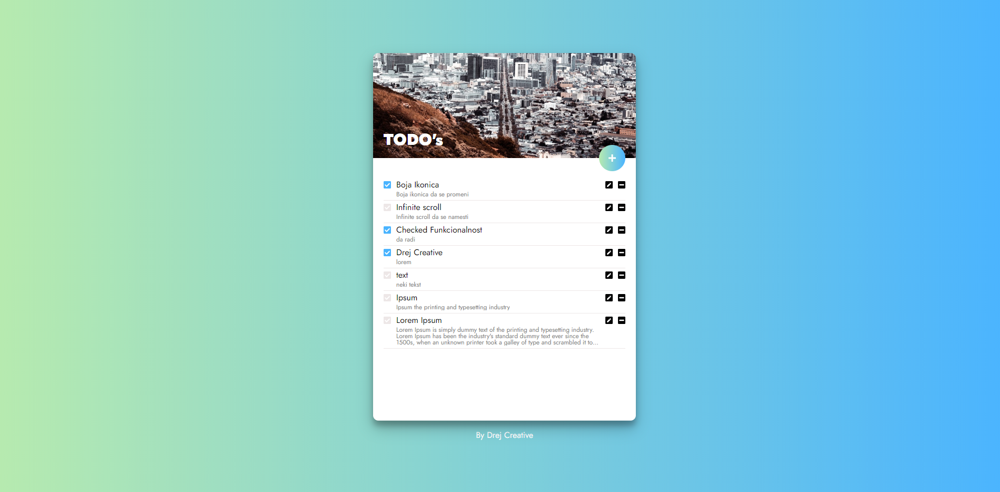
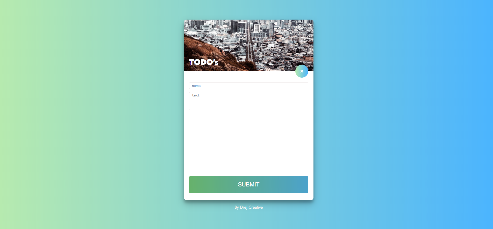

# MERN Stack boilerplate (NextJS Version)

My personal MERN stack starter boilerplate done with NextJs, so I dont have to type it every time from scratch. It is optimized for server side render React apps. I added simple but efective Todo app just to show all features annd to have setup and test all the routes, and react state management.

> Node, ExpressJs and MongoDB in backend.

> NextJs used to connect it all

> Frontend is latest React with Hooks, useContext with useReducer instead of Redux. Css Modules and css variables included.

## Install
Clone this project with `git clone https://github.com/drejcreative/mern-boilerplate-nextjs-2020.git`

After it install all backend dependencies with `yarn`
Then run the same command in `client` folder to install all frontend dependencies 

## Development server
Change MongoDB url to your one in `next.config.js` file.

Run `npm run dev` or `yarn dev` for a dev server. 

Run `npm run client` to start react app, or run `yarn start` in `client` folder.
It will automatically open your default browser and show the app. It has a live reload integrated.

## Build with
This is a [Next.js](https://nextjs.org/) project bootstrapped with [`create-next-app`](https://github.com/zeit/next.js/tree/canary/packages/create-next-app).